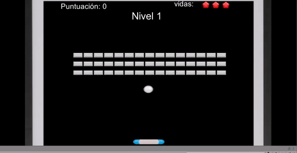
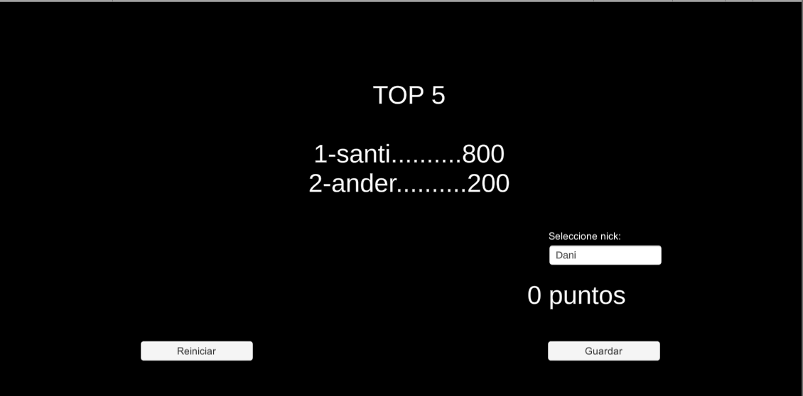

# arkanoid
arkanoid Ander Zugasti
# Arkanoid Survival

_El Arkanoid survival es el juego del arkanoid normal, solo que se tienen tres vidas para pasarse los tres niveles_

## Pantalla de inicio 

_La pantalla de inicio es muy simple tan solo tenemos el botón para empezar y el titulo_


## Pantalla de juego 

_Segun se entra en la partida la bola se empieza a desplazar._

```
En caso de estar en el ordenador se manejara con las direcciones derecha e izquierda del teclado,
y en el movil pulsando en cada lado de la pantalla
```

```
Cada ladrillo puntuara 100 puntos, cuando la bola caiga al suelo, esta se lanzara de nuevo a la misma 
velocidad que al incio y se perdera una vida
```

_Cuando se pierdan todas las vidas apareceran dos opciones para seleccionar:_

#### Reiniciar:
_Nos permite reiniciar la partida_
#### Puntuación:
_Nos lleva a la pantalla de puntuaciones donde veremos la clasificación_
## Pantalla puntuación

_En esta pantalla tendremos tres partes:_



#### Boton Reinicio

_Nos permite reiniciar el juego_

#### Ranking

_Veremos como esta el ranking del juego_

#### Guardar

_Nos da la posibilidad de guardar el nuestra puntuación con un nick_

# Problemas 
_En primer lugar tengo que decir que primero hice un juego que funcionaba to todo bien, hasta que incorpore la base de datos firebase, la cual me fastidio todo lo que habia planteado y tube que volver a hacer cazsi todo el proyecto._

```Con Esto llega mi segundo problema, que me ha comido muchas horas``` 
_Al tener que generar un objeto que pase de una escena a otra, he generado si querer una variable indestructible, a la que le da igual el valor que le asignes, y sumara la puntuacón que consiga el usuario hasta que este cierre el juego._

```El gran problema es que esa puntación es la que se guarda en la base de datos```


